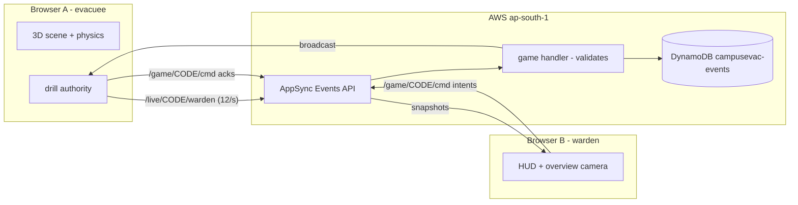

# CampusEvac

A two-player, real-time evacuation drill that runs in the browser.

- The **evacuee** walks through a smoky campus building in first person and has to reach the
  outdoor assembly point.
- The **warden** watches the same building from above, verifies evidence, sends route guidance
  and triggers one intervention (ventilation).
- Neither player can win alone. Everything they do is synced live over **AWS AppSync Events**,
  and every lobby action and command is recorded in **Amazon DynamoDB**.

> Training simulation only. Not live emergency guidance or a safety certification.

---

## Contents

1. [Run it locally](#1-run-it-locally)
2. [Set up AWS from the CLI](#2-set-up-aws-from-the-cli)
3. [Prompt for your AI coding agent](#3-prompt-for-your-ai-coding-agent)
4. [Deploy the website](#4-deploy-the-website)
5. [How it works](#5-how-it-works)
6. [How the AWS backend was built (commands used)](#6-how-the-aws-backend-was-built-commands-used)
7. [Doing the same in the AWS Console instead](#7-doing-the-same-in-the-aws-console-instead)
8. [Project structure, file by file](#8-project-structure-file-by-file)
9. [Scripts](#9-scripts)
10. [Security](#10-security)
11. [Troubleshooting](#11-troubleshooting)

---

## 1. Run it locally

### Requirements

| Tool | Version | Check |
| --- | --- | --- |
| Node.js | 20.9 or newer | `node --version` |
| npm | comes with Node | `npm --version` |
| A browser with WebGL | Chrome, Edge, Firefox, Safari | open the site |

### Steps

```bash
# 1. install the web app
npm install

# 2. create your local env file
cp .env.example .env.local          # Windows PowerShell: copy .env.example .env.local
```

Fill in `.env.local` with the three values from your AppSync Events API:

```bash
NEXT_PUBLIC_EVENTS_HTTP_HOST=xxxxxxxxxxxxxxxxxxxxxxxxxx.appsync-api.ap-south-1.amazonaws.com
NEXT_PUBLIC_EVENTS_REALTIME_URL=wss://xxxxxxxxxxxxxxxxxxxxxxxxxx.appsync-realtime-api.ap-south-1.amazonaws.com/event/realtime
NEXT_PUBLIC_EVENTS_API_KEY=da2-xxxxxxxxxxxxxxxxxxxxxxxxxx
```

```bash
# 3. start the app
npm run dev
```

Open <http://localhost:3000>.

### Try a two-player drill

1. Open two browser windows side by side at <http://localhost:3000/simulation/rooms>.
2. In window A choose **Open room**, enter a name and choose **Open drill**.
3. Copy the invite link from window A and open it in window B, then choose **Join**.
4. After the 10-second countdown, one window becomes the **evacuee** and the other the
   **warden**.
5. Evacuee: `WASD` to move, `Shift` to sprint, `Space` to jump, `E` to interact, and click the
   scene to look with the mouse.
6. Warden: choose **Observe** → **Verify east route** → **Send west route** →
   **Apply ventilation**. Each action shows up on the evacuee's screen within a fraction of a
   second.

`/simulation/play` is a single-player sandbox that needs no AWS at all.

> After editing `.env.local`, stop and restart `npm run dev`. Next.js reads env files only at
> startup.

---

## 2. Set up AWS from the CLI

You only need this once per AWS account, or again when the backend in `infra/` changes.

### 2.1 Install the AWS CLI v2

| OS | Command |
| --- | --- |
| Windows | https://docs.aws.amazon.com/cli/latest/userguide/getting-started-install.html (irm https://awscli.amazonaws.com/v2/install.ps1 \| iex) (then open new terminal and test with aws --version) |
| macOS | `brew install awscli` |
| Linux | follow <https://docs.aws.amazon.com/cli/latest/userguide/getting-started-install.html> |

```bash
aws --version        # expect aws-cli/2.x
```

### 2.2 Sign in

```bash
aws login                                   # opens the browser, uses your console sign-in
aws sts get-caller-identity                 # shows the account you are signed in to
aws configure set region ap-south-1         # Mumbai
```

- `aws login` needs a recent CLI v2. If it isn't available, update the CLI, or use
  `aws configure sso` with IAM Identity Center.
- Don't create long-lived access keys for the root user. Sign in as an IAM user or an Identity
  Center user with admin rights for the deploy.

no need to deploy backend now -- great if you can! (@github.com/abhishiv17)

### 2.3 Deploy the backend (creates the DynamoDB table and the AppSync Event API)

Run these from the **project root**, signed in to your own AWS account:

```bash
npm run infra:install      # installs the CDK tooling inside infra/ (separate from the web app)
npm run infra:bootstrap    # once per account + region: creates the CDK deploy bucket and roles
npm run infra:deploy       # creates the DynamoDB table + AppSync Events API, writes infra/cdk-outputs.json
```

The deploy ends by printing `CampusEvacStack.HttpHost`, `CampusEvacStack.RealtimeEndpoint` and
`CampusEvacStack.ApiKey`: the three values `.env.local` needs.

### 2.4 Write `.env.local` from the outputs

Run this from the project root. It works in bash, zsh and PowerShell:

```bash
node -e "const o=require('./infra/cdk-outputs.json').CampusEvacStack;require('fs').writeFileSync('.env.local','NEXT_PUBLIC_EVENTS_HTTP_HOST='+o.HttpHost+'\nNEXT_PUBLIC_EVENTS_REALTIME_URL='+o.RealtimeEndpoint+'\nNEXT_PUBLIC_EVENTS_API_KEY='+o.ApiKey+'\n')"
```

**No `infra/cdk-outputs.json`?** (for example, the backend was deployed from another machine)
Read the same three values straight from AWS with the CLI. `npm run env:pull` writes
`.env.local` for you, or look them up manually. These commands print your key, so don't share
the output:

```bash
# all three at once: HttpHost, RealtimeEndpoint, ApiKey
aws cloudformation describe-stacks --stack-name CampusEvacStack --query "Stacks[0].Outputs" --output table

# or from AppSync directly
aws appsync list-apis --query "apis[?name=='campusevac-realtime'].apiId | [0]" --output text   # -> <api-id>
aws appsync get-api --api-id <api-id> --query "api.dns"                                         # HTTP and REALTIME domains
aws appsync list-api-keys --api-id <api-id> --query "apiKeys[].id"                              # the da2- API key
```

Map them into `.env.local`:

| Output | Variable |
| --- | --- |
| `HttpHost` (or `dns.HTTP`) | `NEXT_PUBLIC_EVENTS_HTTP_HOST` |
| `RealtimeEndpoint` (or `wss://<dns.REALTIME>/event/realtime`) | `NEXT_PUBLIC_EVENTS_REALTIME_URL` |
| `ApiKey` (the `da2-` key) | `NEXT_PUBLIC_EVENTS_API_KEY` |

Then run `npm run dev` and try the two-window drill above.

### 2.5 Remove everything from AWS

```bash
npm --prefix infra exec cdk destroy
```

This deletes the Event API, the API key and the DynamoDB table (including stored drill events).

---

## 3. Prompt for your AI coding agent


```text
Set up this CampusEvac project on my machine and connect it to AWS.

1. Check `node --version` is 20.9+ and `aws --version` is AWS CLI v2. If the AWS CLI is
   missing, tell me the install command for my OS and wait.
2. Run `aws sts get-caller-identity`. If it fails, ask me to run `aws login` myself (it
   opens a browser) and wait. Never ask me to paste access keys.
3. Make sure the region is ap-south-1 (`aws configure get region`); set it only if I agree.
4. From the project root run: `npm install`, `npm run infra:install`,
   `npm run infra:bootstrap` (skip if the CDKToolkit stack already exists in the region),
   then `npm run infra:deploy`.
5. Create `.env.local` from `infra/cdk-outputs.json` with exactly these keys:
   NEXT_PUBLIC_EVENTS_HTTP_HOST (HttpHost), NEXT_PUBLIC_EVENTS_REALTIME_URL
   (RealtimeEndpoint), NEXT_PUBLIC_EVENTS_API_KEY (ApiKey).
6. Run `npm run typecheck`, `npm run lint`, `npm run build`, then `npm run dev`.
7. Tell me to open http://localhost:3000/simulation/rooms in two windows to test.
8. Also check .env.example for what's required and configure AWS accordingly.

Rules: do not commit `.env.local` or `infra/cdk-outputs.json`, do not put AWS keys in
any file, and read README.md sections 5-8 before changing code.
```

---

## 4. Deploy the website

Everything in `infra/` is deployed **once** to AWS from a developer machine (section 2). The
website is a normal Next.js app at the project root, so any Next.js host can run it. It only
needs the three `NEXT_PUBLIC_EVENTS_*` variables.

### Why hosts don't need `infra/node_modules`

The repo holds **two separate npm projects**:

| Folder | What it is | Who installs it |
| --- | --- | --- |
| `/` (root) | The Next.js website | You locally, and Vercel/Amplify on every deploy |
| `/infra` | AWS CDK code that creates the backend | Only whoever deploys the AWS backend |

A hosting platform runs `npm install` + `npm run build` in the root only, so it never
downloads the ~230 MB of CDK tooling. `.vercelignore` also leaves `infra/` out of Vercel
uploads, and `tsconfig.json` excludes it from the website's type-check. The root
`npm run infra:*` scripts let you drive the backend from the root without merging the two
projects.

### 4.1 Vercel (quickest)

**Dashboard**

1. Push the repo to GitHub.
2. In Vercel choose **Add New… → Project → Import** your repository.
3. Framework preset: **Next.js** (auto-detected). Root directory: `./`. Leave the build and
   install commands as their defaults.
4. Under **Environment Variables**, add all three `NEXT_PUBLIC_EVENTS_*` values for
   **Production** and **Preview**.
5. Choose **Deploy**.

**CLI alternative**

```bash
npm i -g vercel
vercel login
vercel link
vercel env add NEXT_PUBLIC_EVENTS_HTTP_HOST production
vercel env add NEXT_PUBLIC_EVENTS_REALTIME_URL production
vercel env add NEXT_PUBLIC_EVENTS_API_KEY production
vercel --prod
```

> `NEXT_PUBLIC_*` values, and the Content-Security-Policy that allows the AppSync domains, are
> baked in **at build time**. If you change them in Vercel, redeploy.

Nothing needs changing on the AWS side. The API key works from any origin, including
`*.vercel.app` and custom domains.

### 4.2 AWS Amplify Hosting (all-AWS option)

1. Open **AWS Amplify → Create new app → GitHub** and pick the repository and branch.
2. Amplify detects Next.js (SSR). Keep the build command `npm run build`.
3. In **Environment variables**, add the same three `NEXT_PUBLIC_EVENTS_*` values.
4. Choose **Save and deploy**.

`/simulation/room/[code]` is server-rendered on demand, so use Amplify's Next.js SSR hosting,
not a static export.

### 4.3 Any Node.js server or Docker

```bash
npm ci
npm run build
npm run start          # serves on port 3000; set PORT to change it
```

---

## 5. How it works

### 5.1 Big picture



There is **no game server**:

- **AppSync Events** is a managed WebSocket pub/sub service. Browsers connect to it, subscribe
  to channels and publish messages.
- **The two browsers share the game logic:**
  - The **host's browser** runs the lobby: it admits players, runs the countdown and draws
    roles.
  - Once the drill starts, the **evacuee's browser** is the authority for the drill. It already
    runs the physics and the smoke simulation, so it also checks every warden command and
    streams the warden's view.
- **DynamoDB** stores every lobby and command message as an event log (auto-deleted after
  7 days). Movement is never stored.

### 5.2 Channels

AppSync Events organises channels into **namespaces**. This API has two:

| Channel | Direction | Carries | Handler | Stored |
| --- | --- | --- | --- | --- |
| `/live/{CODE}/warden` | evacuee → warden | Warden snapshot about 12×/s: evacuee position and heading, sector, air, route status, evidence, last message | none (fastest path) | no |
| `/game/{CODE}/room` | everyone ↔ everyone | Lobby: `sync`, `room`, `reject`, `leave` | `infra/src/game-handler.js` | yes |
| `/game/{CODE}/cmd` | warden ↔ evacuee | `intent` (warden command) and `ack` (accepted/denied) | `infra/src/game-handler.js` | yes |

Each browser keeps **one WebSocket** open and subscribes to `/game/{CODE}/*` and
`/live/{CODE}/warden`.

### 5.3 A drill, step by step

1. **Open room.** The host's browser subscribes and sends a `sync` probe; if another browser
   already holds that room it adopts that copy. Otherwise it creates the room locally with
   `rev: 1`.
2. **Join.** The guest publishes `sync` with its participant details, repeating every 1.5 s
   for up to 6 s. The host admits them and publishes a `room` snapshot, or a `reject` if the
   room is full or started.
3. **Countdown.** When both seats are filled the host sets `phase: "preparing"` and
   `startsAt = now + 10 s`. Every browser shows the same timer from `startsAt`.
4. **Role draw.** At zero the host publishes `phase: "active"`. Roles come from a seeded
   random draw (`net/roles.ts`), so every browser computes the same result.
5. **Play.**
   - The evacuee's render loop publishes a warden snapshot on `/live` 12 times a second.
   - The warden's HUD applies each snapshot, and the runner figure glides to the new position.
   - A warden command is published as an `intent`. The evacuee's browser checks the role,
     phase, evidence state and duplicate key, applies it, then replies with an `ack` and a
     fresh snapshot.
   - An accepted **Send west route** also shows a route card to the evacuee. An accepted
     **Apply ventilation** thins the smoke.
6. **Outcome.** Reaching the assembly beacon (or running out of air) publishes
   `phase: "assembly"` or `"failed"`. Both players see a three-question debrief.

### 5.4 Keeping browsers in agreement

| Problem | How it is handled |
| --- | --- |
| Two room snapshots arrive out of order | Every snapshot has a `rev` number; browsers keep the highest. |
| A command is sent twice (retry or double click) | Every intent has an `idempotencyKey`; a repeat returns the original ack and changes nothing. |
| Invalid order (send route before verifying) | The evacuee authority denies it with a reason, e.g. "verify the east route first". |
| Network drops | `net/events.ts` reconnects with jittered backoff (up to 10 s), resubscribes, and flushes up to 50 queued messages. High-frequency snapshots are dropped while offline rather than queued. |
| Silent dead socket | AppSync sends a keep-alive every minute; if none arrives within the timeout the socket is closed and reconnected. |
| Refresh mid-drill | The participant id is kept in `sessionStorage`, so a refreshed tab re-syncs into the same seat. |

### 5.5 What is stored in DynamoDB

Table `campusevac-events`: on-demand billing, partition key `pk` (String), sort key `sk`
(String), TTL attribute `ttl`.

| Attribute | Example | Meaning |
| --- | --- | --- |
| `pk` | `DRILL#TEST8` | One partition per drill |
| `sk` | `1789369196846#4780088e-…` | Server time (ms) + AppSync event id, so items sort in order |
| `kind` | `room` or `cmd` | Which `/game` channel it came from |
| `at` | `1789369196846` | Server time in milliseconds |
| `ttl` | `1789973996` | Epoch seconds, 7 days later; DynamoDB deletes the item after this |
| `payload` | `{ "t": "intent", "from": "p_…", "intent": { … } }` | The message exactly as published |

Read a drill's history:

```bash
aws dynamodb query --table-name campusevac-events --region ap-south-1 \
  --key-condition-expression "pk = :pk" \
  --expression-attribute-values '{":pk":{"S":"DRILL#ABCDE"}}'
```

> The console's **Item count** and **Table size** figures refresh only every few hours. Use
> **Explore table items** to see new rows immediately.

### 5.6 The `game` handler (runs inside AppSync, not Lambda)

`infra/src/game-handler.js` runs on every publish to `/game/...`:

1. **Channel check.** The room code must be 4–8 characters of `A-Z0-9`, and the channel must
   be `room` or `cmd`. Anything else gets `UnauthorizedException`.
2. **Message filter.** It keeps only messages whose `t` is `sync`, `room`, `reject`, `leave`,
   `intent` or `ack`, that include a `from` string, and that are 8,000 characters or less.
   Other messages are silently dropped.
3. **Store and broadcast.** It writes the kept messages to DynamoDB with `batchPut`, then
   broadcasts them.

It's written for AppSync's restricted **APPSYNC_JS** runtime: no regular expressions, no
`try`/`throw`, no classic `for` loops, and no `includes` (it uses `indexOf`). Check changes
before deploying:

```bash
aws appsync evaluate-code --region ap-south-1 \
  --runtime name=APPSYNC_JS,runtimeVersion=1.0.0 \
  --code file://infra/src/game-handler.js --function request --context '{}'
```

A `LINT_ERROR` in the output means AppSync will reject the deploy.
`Unable to find valid export for request` is expected and fine: the handler exports
`onPublish`, not `request`.

---

## 6. How the AWS backend was built (commands used)

The backend is **infrastructure as code** with the AWS CDK (TypeScript). One command creates or
updates everything, the setup lives in git, and `cdk destroy` removes it. These are the
commands run while setting it up, in order:

```bash
# confirm the CLI and the signed-in account
aws --version
aws sts get-caller-identity
aws configure get region                           # -> ap-south-1

# confirm AppSync Event APIs exist in the region (an empty list means yes)
aws appsync list-apis --region ap-south-1

# was CDK already bootstrapped here? ("does not exist" -> bootstrap needed)
aws cloudformation describe-stacks --stack-name CDKToolkit --region ap-south-1

# install the CDK library and CLI inside infra/
cd infra
npm install aws-cdk-lib constructs
npm install -D aws-cdk tsx typescript @types/node

# one-time bootstrap of the account + region
npx cdk bootstrap aws://<ACCOUNT_ID>/ap-south-1

# check, preview, deploy
npx tsc --noEmit
npx cdk synth --quiet
npx cdk deploy --outputs-file cdk-outputs.json

# lint the AppSync handler before deploying changes
aws appsync evaluate-code --region ap-south-1 --runtime name=APPSYNC_JS,runtimeVersion=1.0.0 \
  --code file://src/game-handler.js --function request --context '{}'

# verify the table and the stored events
aws dynamodb describe-table --table-name campusevac-events --region ap-south-1
aws dynamodb query --table-name campusevac-events --region ap-south-1 \
  --key-condition-expression "pk = :pk" \
  --expression-attribute-values '{":pk":{"S":"DRILL#TEST8"}}'
```

Those steps are now wrapped by the root scripts (`npm run infra:install`, `infra:bootstrap`,
`infra:deploy`).

Two-client test scripts published and subscribed over the real WebSocket to check:
- delivery on both channels
- that commands are accepted, denied and deduplicated correctly
- that invalid messages are dropped
- that valid messages land in DynamoDB

### What the stack creates

Defined in `infra/lib/campusevac-stack.ts`:

| Resource | Details |
| --- | --- |
| `AWS::DynamoDB::Table` `campusevac-events` | `pk`/`sk` strings, on-demand, TTL on `ttl`. Removal policy DESTROY: deleting the stack deletes the table. |
| `AWS::AppSync::Api` `campusevac-realtime` | Event API with API key auth for connect, publish and subscribe |
| `AWS::AppSync::ApiKey` `game` | Expires 365 days after the last deploy; redeploy to extend it |
| `AWS::AppSync::ChannelNamespace` `live` | No handler: pure broadcast, lowest latency |
| `AWS::AppSync::ChannelNamespace` `game` | `onPublish` = `src/game-handler.js` with the DynamoDB data source |
| `AWS::AppSync::DataSource` `EventStore` | Connects the Event API to the table |
| `AWS::IAM::Role` + `Policy` | Lets AppSync read and write only that table |

### Cost

Everything is pay-per-use, with no servers or hourly charges:
- **AppSync Events** bills per message and per connection-minute.
- **DynamoDB on-demand** bills per write and per GB stored.

A hackathon's worth of drills costs cents. Set a zero-spend budget in **Billing → Budgets** to
be emailed if anything starts to cost money.

---

## 7. Doing the same in the AWS Console instead

You can create the same backend by clicking through the console. The CDK was used instead
because it's repeatable, reviewable in git, and one command recreates everything in a new
account or region. If you use the console, don't also run `infra:deploy` into the same account
with the same names.

### 7.1 DynamoDB table

1. Open **DynamoDB → Tables → Create table**. Check the region selector (top right) says
   **Asia Pacific (Mumbai)**.
2. **Table name:** `campusevac-events`.
3. **Partition key:** `pk`, type String. **Sort key:** `sk`, type String.
4. **Table settings:** choose **Customize settings**, then **Capacity mode: On-demand**.
5. Choose **Create table**.
6. Open the table and go to **Additional settings → Time to Live (TTL) → Turn on**. Set
   **TTL attribute name** to `ttl`.

### 7.2 AppSync Event API

1. Open **AWS AppSync → Create API → Event API**.
2. **API name:** `campusevac-realtime`, then choose **Create**. The console creates API key
   authorization and a namespace called `default`.
3. Open **Namespaces**. Create a namespace named `live` with no handler. Create another named
   `game`. You can delete `default`.

### 7.3 Connect `game` to DynamoDB

1. In the API, open **Data sources → Create data source**.
2. Name it `EventStore`, set the type to **Amazon DynamoDB table**, the region to
   `ap-south-1`, and the table to `campusevac-events`.
3. Let the console **create a new role**, then choose **Create**.
4. Open **Namespaces → game** and edit its event handlers. For **onPublish**, choose code with
   a data source, select `EventStore`, paste the contents of `infra/src/game-handler.js`, and
   save.

### 7.4 Get the values for `.env.local`

1. Open **Settings**:
   - **HTTP domain** → `NEXT_PUBLIC_EVENTS_HTTP_HOST` (host only, no `https://`)
   - **Real-time domain** → `NEXT_PUBLIC_EVENTS_REALTIME_URL`, written as
     `wss://<real-time domain>/event/realtime`
   - **API keys** → `NEXT_PUBLIC_EVENTS_API_KEY`
2. Test it in the **Pub/Sub Editor**:
   - Subscribe to `/game/TEST1/*`.
   - Publish `[{"t":"sync","from":"console"}]` to `/game/TEST1/room`.
   - The event should appear in the subscriber log and as a new item in the table.

---

## 8. Project structure, file by file

```text
.
├── app/                         Next.js App Router: the website
│   ├── layout.tsx
│   ├── page.tsx
│   ├── globals.css
│   ├── favicon.ico
│   └── simulation/              the game
│       ├── rooms/page.tsx
│       ├── room/[code]/page.tsx
│       ├── room/[code]/RoomClient.tsx
│       ├── play/page.tsx
│       ├── DrillShell.tsx
│       ├── DrillCanvas.tsx
│       ├── session.ts
│       ├── store.ts
│       ├── runtime.ts
│       ├── level.ts
│       ├── smoke.ts
│       ├── commands.ts
│       ├── controls.ts
│       ├── audio.ts
│       ├── useCoarsePointer.ts
│       ├── components/          3D scene and HUD pieces
│       └── net/                 realtime networking
├── public/                      static files served as-is
├── infra/                       AWS backend (separate npm project)
│   ├── bin/campusevac.ts
│   ├── lib/campusevac-stack.ts
│   ├── src/game-handler.js
│   ├── cdk.json
│   ├── package.json / package-lock.json
│   └── tsconfig.json
├── next.config.ts
├── package.json / package-lock.json
├── tsconfig.json
├── eslint.config.mjs
├── postcss.config.mjs
├── .env.example
├── .gitignore
└── .vercelignore
```

### `app/`: pages and global styles

| File | What it does |
| --- | --- |
| `layout.tsx` | Root HTML shell: Geist fonts, page title/description, mobile viewport (fits notches; keeps controls in place when a keyboard opens). |
| `page.tsx` | Landing page: product pitch, how a drill runs, and links to create a room or try solo. |
| `globals.css` | Imports Tailwind, defines colour tokens and the custom classes (`brutal-*` landing style, `hud-panel` in-game panels, `signal-pulse` animation), and respects reduced-motion settings. |
| `favicon.ico` | Browser tab icon. |

### `app/simulation/`: the game

**Pages (routes)**

| File | Route | What it does |
| --- | --- | --- |
| `rooms/page.tsx` | `/simulation/rooms` | Create a room (random 5-character code, marks this tab as host) or join by typing a code. |
| `room/[code]/page.tsx` | `/simulation/room/ABCDE` | Server component. Rejects anything that isn't a 4–8 character `A-Z0-9` code with a 404, then renders `RoomClient`. |
| `room/[code]/RoomClient.tsx` | same | The lobby: name entry, connecting and error screens, seat list, invite link and share button, countdown, "Start now" for the host. Switches to `DrillShell` once the drill is active. |
| `play/page.tsx` | `/simulation/play` | Solo sandbox. Runs the full simulation locally with no network; keys `1`/`2`/`3` switch between the evacuee, warden and evidence views. |

**Game shell and scene**

| File | What it does |
| --- | --- |
| `DrillShell.tsx` | Everything drawn over the 3D view:<br>• hazard banner, warden route-message card, air/stamina bars, objective text<br>• evidence panel (Observe/Verify), warden command deck, drill log, minimap<br>• first-run briefing and the end-of-drill debrief<br>It also applies incoming warden snapshots and lazy-loads the 3D canvas. |
| `DrillCanvas.tsx` | Creates the React Three Fiber `<Canvas>`, keyboard map and Rapier `<Physics>` world. Physics runs only in the evacuee or solo browser; the warden just displays positions. |

**State and logic**

| File | What it does |
| --- | --- |
| `session.ts` | Zustand store for the **network session**: connect, create/join room, start, leave, send warden commands, publish evacuee state, and pass incoming events to the HUD. |
| `store.ts` | Zustand store for the **simulation and HUD**: role/mode, camera view, air, smoke, route status, evidence, route message, last acknowledgement, log, outcome, and the actions that change them. |
| `runtime.ts` | Plain mutable object for per-frame values (positions, heading, touch input, interact target). Kept outside React so 60 fps updates don't cause re-renders. |
| `level.ts` | The authored map: rooms with bounds and camera poses, walls and openings, floors, doors, evidence/intervention markers, spawn point, assembly point, and `roomAt(x, z)`. |
| `smoke.ts` | Deterministic smoke timeline: when smoke reaches each sector and how thick it gets, when the east route becomes unsafe (52 s), how fast air drains, and how much ventilation helps. |
| `commands.ts` | The four warden commands: code, label, description, colour. |
| `controls.ts` | `pressUse()` / `pressJump()`, shared by keyboard and touch buttons so both behave identically. |
| `audio.ts` | Short alert, command and evidence beeps generated with Web Audio (no audio files). |
| `useCoarsePointer.ts` | Detects a touch-first device to switch to on-screen controls. |

**`app/simulation/components/`: 3D and HUD building blocks**

| File | What it does |
| --- | --- |
| `Building.tsx` | Walls (split around door openings), floors, ceilings, swinging doors, the red east-route barrier, and "unexplored" fog volumes in solo mode. Walls are cut to knee height in the warden's overview. |
| `Rooms.tsx` | Furniture layout and signs for the foyer, utility lab and dorm wing, with edge lights and passage frames. |
| `Furniture.tsx` | Reusable low-poly props built from boxes: desks, monitors, chairs, shelves, lockers, racks, plants, sofas, crates, lights and more. |
| `Exterior.tsx` | Everything outside: gradient sky shader, street lamps, planters, city skyline, the ground collider, and the glowing assembly beacon. |
| `Evacuee.tsx` | **Local evacuee:** physics capsule, WASD/touch movement, sprint, jump, first-person camera.<br>**Remote evacuee (warden's view):** the same figure, smoothly interpolated toward each network snapshot. |
| `Interactables.tsx` | Evidence targets, the ventilation panel (changes colour when applied) and the west-route sign. |
| `Markers.tsx` | Floating neon labels, glowing outline boxes, and clickable evidence overlays. |
| `ViewRig.tsx` | Cameras and atmosphere:<br>• first-person camera with pointer-lock mouse look<br>• warden camera that follows the evacuee's current room and auto-fits it to the window<br>• smoke fog density and ambient lights |
| `Systems.tsx` | The evacuee's per-frame simulation: current sector, smoke exposure and air, interact prompts, assembly and ventilation proximity. |
| `NetSync.tsx` | Publishes the evacuee's state 12 times per second from the render loop. |
| `Minimap.tsx` | SVG floor plan with the evacuee's live dot and heading arrow. |
| `TouchControls.tsx` | Phone controls: left-thumb joystick, right-side look pad, Interact and Jump buttons. |

**`app/simulation/net/`: realtime networking**

| File | What it does |
| --- | --- |
| `events.ts` | Low-level **AppSync Events WebSocket client**: API-key auth subprotocol, `connection_init`, subscribe and publish (batches of 5), keep-alive watchdog, reconnect with jittered backoff, resubscribe, offline queue. |
| `eventsNet.ts` | The **drill protocol** on top of `events.ts`:<br>• lobby ownership, admission, rejection, countdown, role assignment<br>• `rev` ordering of room snapshots<br>• the evacuee-side authority that validates and applies warden commands and publishes snapshots |
| `roles.ts` | Seeded random role draw (same result in every browser) and the countdown → active transition. |
| `types.ts` | Shared TypeScript types: rooms, participants, evidence, route messages, acks, snapshots, intents, network events, the `NetClient` interface. |
| `index.ts` | `createNet()`, the single place the app creates its network client. |

### `public/`: static files

| File | Used by |
| --- | --- |
| `facility.webp` | Landing-page facility image (82 KB). |
| `mascot.webp` | Landing-page mascot (34 KB). |

Files here are served from the site root, e.g. `/facility.webp`.

### `infra/`: the AWS backend (AWS CDK)

| Path | What it does |
| --- | --- |
| `bin/campusevac.ts` | CDK **entry point**. Creates the CDK app and one `CampusEvacStack` in your CLI account and region (defaults to `ap-south-1`). |
| `lib/campusevac-stack.ts` | The **stack definition**: DynamoDB table, Event API and API key, `live` and `game` namespaces, DynamoDB data source, and the printed outputs. |
| `src/game-handler.js` | The **onPublish handler** for the `game` namespace. Runs inside AppSync's JavaScript runtime (not Lambda) to validate, store and broadcast (section 5.6). |
| `cdk.json` | Tells the CDK CLI how to run the app (`npx tsx bin/campusevac.ts`). |
| `package.json` / `package-lock.json` | CDK dependencies (`aws-cdk-lib`, `constructs`, `aws-cdk`, `tsx`) and scripts `typecheck`, `bootstrap`, `synth`, `deploy`. |
| `tsconfig.json` | TypeScript settings for the CDK code (`nodenext` modules). |
| `node_modules/` | Generated by `npm run infra:install`. Not committed, not needed by the website or its host. |
| `cdk-outputs.json` | Generated by `infra:deploy`. Holds the endpoints and API key. Git-ignored. |
| `cdk.out/` | Generated by `synth`/`deploy` (CloudFormation templates). Git-ignored. |

### Root configuration

| File | What it does |
| --- | --- |
| `package.json` | Website dependencies, Node version (`>=20.9.0`) and all scripts, including `infra:*` shortcuts. |
| `next.config.ts` | Security headers for every page: `nosniff`, referrer policy, permissions policy, no `x-powered-by`. In production it also sets a Content-Security-Policy (only this site plus the AppSync domains) and HSTS. |
| `tsconfig.json` | TypeScript for the website (excludes `infra/`). |
| `eslint.config.mjs` | Next.js + TypeScript lint rules. |
| `postcss.config.mjs` | Enables Tailwind CSS v4. |
| `.env.example` | Template listing the three required variables. Committed. |
| `.env.local` | Your real values. Git-ignored. |
| `.gitignore` | Keeps dependencies, build output, env files and CDK outputs out of git. |
| `.vercelignore` | Keeps `infra/` out of Vercel uploads. |
| `next-env.d.ts`, `.next/`, `tsconfig.tsbuildinfo` | Generated by `next dev` / `next build` / `tsc`. Git-ignored; safe to delete. |

---

## 9. Scripts

Run from the project root.

| Command | What it does |
| --- | --- |
| `npm run dev` | Start the dev server at <http://localhost:3000>. |
| `npm run build` | Production build (also type-checks). |
| `npm run start` | Serve the production build. |
| `npm run lint` | ESLint over the whole repo. |
| `npm run typecheck` | TypeScript check of the website. |
| `npm run infra:install` | Install CDK tooling in `infra/`. |
| `npm run infra:bootstrap` | One-time CDK bootstrap for the current account and region. |
| `npm run infra:synth` | Generate the CloudFormation template without deploying (a good dry run). |
| `npm run infra:deploy` | Create or update the AWS backend and write `infra/cdk-outputs.json`. |

---

## 10. Security

**What is protected**

- **No AWS credentials in the app.** The browser only has the AppSync Events API key, which can
  connect, publish and subscribe on this one API and nothing else.
- **Server-side validation.** The `game` handler rejects bad room codes and unknown channels,
  and drops malformed or oversized messages before storing or broadcasting.
- **Least-privilege storage.** DynamoDB is reachable only through AppSync's role, scoped to the
  one table.
- **Browser hardening.** Production responses send a strict Content-Security-Policy (scripts
  from this site only; network connections only to this site and the AppSync domains; no
  framing), HSTS, `nosniff`, a referrer policy and a permissions policy that disables camera,
  microphone and location. Invalid room URLs return 404.
- **Secrets stay out of git.** `.env.local` and `infra/cdk-outputs.json` are ignored, and
  dependencies are checked with `npm audit`.
- **Automatic cleanup.** Stored events delete themselves after 7 days.

**Known limits (fine for a hackathon demo, fix before real use)**

- **Players aren't authenticated.** Anyone with the site (and so the public API key) could
  publish messages that pretend to come from a participant. Add Amazon Cognito or a Lambda
  authorizer, and check identity in the handler, before any real-world use.
- **The API key expires** 365 days after the last deploy. Run `npm run infra:deploy` to renew
  it, then update the host's environment variables.
- **Don't deploy as root.** Use an IAM user or IAM Identity Center with only the rights you
  need.

---

## 11. Troubleshooting

| Symptom | Fix |
| --- | --- |
| Lobby shows **Could not reach drill** | `.env.local` is missing or wrong, or the dev server started before you created it. Fix the values and restart `npm run dev`. |
| **No such drill** when joining | The host must have the room open (their tab must stay on the lobby) before the guest joins. Check the code matches. |
| Warden's screen doesn't move | The evacuee's tab must be visible. Browsers pause rendering in hidden tabs, and the evacuee publishes movement from its render loop. |
| `Another next dev server is already running` | Only one `next dev` per folder. Stop the other one (the message shows its PID) or use it. |
| `aws: command not found` right after installing | Open a new terminal so the updated PATH is loaded. |
| CDK says `current credentials could not be used to assume ... deploy-role` | A warning when signed in as root. The deploy still works, but prefer an IAM user. |
| Deploy fails with `Error processing APPSYNC_JS code` | The handler uses JavaScript AppSync doesn't support. Run the `aws appsync evaluate-code` command in section 5.6 to see the exact line. |
| DynamoDB console shows **Item count 0** | Those figures update every few hours. Use **Explore table items**. |
| Vercel site loads but can't connect | The `NEXT_PUBLIC_EVENTS_*` variables weren't set when the site was built. Add them and redeploy. |
