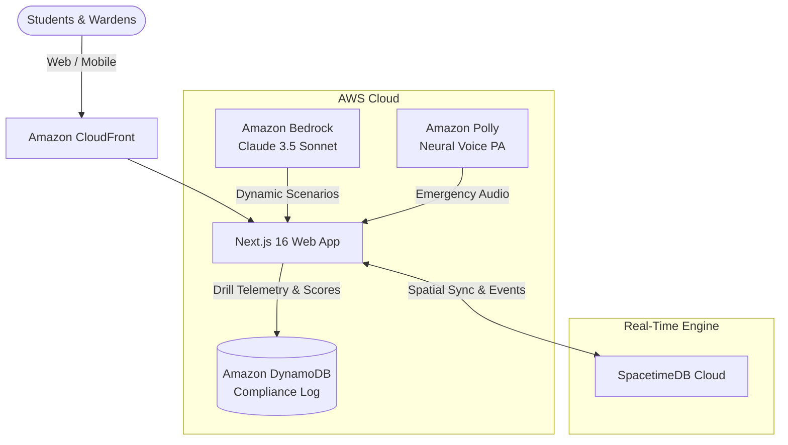

# CampusEvac — Asymmetric Emergency Evacuation Simulator

> **Bharat Builds Tour 2026** (AWS Builder Center × WeMakeDevs)  
> **Event 01: First Commit** | Track: *Ship It*, *Build It*, *Best UI*

**CampusEvac** is an asymmetric, collaborative 3D emergency evacuation drill simulator built with **React Three Fiber**, **Rapier Physics**, **SpacetimeDB**, and **AWS Cloud Services** (*Bedrock, Polly, DynamoDB*).

One student navigates a compromised campus building in first person under low visibility (smoke/fog), while remote floor wardens stationed at CCTV sensor feeds coordinate safe routes, ping hazard zones, and unlock emergency exits in real time.

---

## The Problem

Campus and university hostel emergency drills are historically broken:
* **Passive & Unrealistic:** Students casually walk down hallways during scheduled drills without practicing crisis decision-making or interpreting incomplete information.
* **Communication Gaps:** When actual fires, toxic smoke, or structural hazards strike, panic and lack of real-time communication between floor wardens and evacuees cause stampedes and fatal routing errors.
* **Zero Actionable Telemetry:** Campus safety administrators receive no quantifiable data regarding bottleneck corridors, evacuation latency, or hazard response times.

**CampusEvac turns emergency preparedness into an interactive, high-stakes communication drill.**

---

## Asymmetric Roles & Mechanics

```
┌─────────────────────────────────────────────────────────────┐
│                      THE EVACUATION RUN                     │
├───────────────────────────────┬─────────────────────────────┤
│   Ground Evacuee (1st Person) │ Floor Wardens (CCTV Feeds)  │
├───────────────────────────────┼─────────────────────────────┤
│ • Limited visibility / smoke  │ • Multi-room cutaway views  │
│ • Oxygen & stamina meter      │ • Thermal hazard detection  │
│ • Manual door & panel actions │ • Dynamic safe-route pings  │
│ • Relies on audio directions  │ • Environmental controls    │
└───────────────────────────────┴─────────────────────────────┘
```

### The 1-to-1 Safety Mapping
* **The Evacuee:** Navigates from ground zero to the Safe Assembly Point outside. Blind to hidden hazards around corners.
* **Floor Wardens:** Stationed in specific sectors (Lobby, Control Room, Secure Archives). Switch between **Watch** (thermal CCTV cones) and **Discover** (scan and tag emergency supplies, hazard hotspots, and exit codes).
* **Hazard Cones:** Moving smoke plumes, toxic gas leaks, and spreading fire corridors that drain oxygen on contact.
* **Environmental Controls:** Emergency ventilation switches that clear smoke plumes, master Knox-box keys, and electronic fire doors.
* **Assembly Point:** The final safe extraction zone outside the facility.

---

## AWS Cloud Architecture

CampusEvac leverages AWS native services to provide dynamic drill variation, lifelike audio broadcasts, and institutional safety analytics:



### 1. Amazon Bedrock (Procedural Incident Generator)
Instead of static, predictable drills, Bedrock generates dynamic crisis scenarios on demand:
* Varies fire origin points (electrical short in lab, kitchen grease fire, utility closet combustion).
* Procedurally blocks specific stairwells or exits to force alternative route planning.
* Generates contextual emergency briefings for floor wardens before each run.

### 2. Amazon Polly (Emergency Broadcast System)
Generates realistic, low-latency synthetic emergency PA alerts and tactical radio dispatch chatter (*"Warning: Smoke detected on Sector B. Stairwell East is compromised. Divert evacuee to Fire Exit North."*).

### 3. Amazon DynamoDB (After-Action Reports & Compliance)
Records drill telemetry per session:
* Total evacuation time and oxygen margin.
* Choke-point bottlenecks and hazard exposure events.
* Computes an institutional **Campus Safety Readiness Score (A–F)** for university safety officers.

---

## Quickstart

### Prerequisites
* Node.js 20+ installed
* npm or pnpm

### 1. Installation
```bash
git clone https://github.com/AfreenInnovates/moonshot2.git
cd moonshot2
npm install
```

### 2. Configure Environment
Copy the template and add your credentials:
```bash
cp .env.example .env
```

| Variable | Purpose |
| :--- | :--- |
| `NEXT_PUBLIC_SPACETIME_HOST` | SpacetimeDB cloud endpoint for multiplayer state sync |
| `AWS_REGION` | AWS Region (e.g., `us-east-1` or `ap-south-1`) |
| `AWS_ACCESS_KEY_ID` | AWS IAM Access Key |
| `AWS_SECRET_ACCESS_KEY` | AWS IAM Secret Key |
| `BEDROCK_MODEL_ID` | Amazon Bedrock model (default: `anthropic.claude-3-5-sonnet-20241022-v2:0`) |
| `POLLY_VOICE_ID` | Voice identity for PA announcements (default: `Joanna`) |
| `DYNAMODB_DRILL_TABLE` | DynamoDB table for drill telemetry |

### 3. Run Locally
```bash
npm run dev
```
Open [http://localhost:3000](http://localhost:3000) in your browser.

---

## App Routes

| Route | Functionality |
| :--- | :--- |
| `/` | Mission briefing, problem statement, and quickstart overview. |
| `/rooms` | Lobby creation (2–4 players) or join existing drill session with a room code. |
| `/room/[code]` | Dynamic role gate: automated seeded draw for Evacuee and Floor Wardens. |
| `/play` | Solo training sandbox: toggle between 1st-person Evacuee and CCTV inspection layers. |

---

## Controls

### Desktop
* **Movement:** `W`, `A`, `S`, `D` to move, `Shift` to sprint, `Space` to jump.
* **Interact:** `E` (open doors, toggle ventilation switches, grab emergency keys).
* **Evacuee:** Click mouse for pointer-lock camera looking.
* **Warden:** Fixed isometric cutaway (scroll to zoom, switch between *Watch* and *Discover* layers).

### Mobile / Tablet
* **Evacuee:** On-screen virtual joystick (left thumb) + swipe to look (right thumb) + action buttons (`E`, `JUMP/EXIT`).
* **Warden:** Full-width Command Deck on bottom + tap targets on discovery beacons.

---

## Tech Stack

* **Frontend Framework:** Next.js 16 (App Router, Turbopack)
* **3D & Physics Engine:** React Three Fiber (Three.js) + `@react-three/rapier` (WASM physics)
* **Real-time Spatial Sync:** SpacetimeDB
* **Cloud & AI:** AWS SDK v3 (Amazon Bedrock, Amazon Polly, Amazon DynamoDB)
* **Styling & Icons:** Tailwind CSS v4 + Lucide React

---

## License

Built by the CampusEvac Team for the **Bharat Builds Tour 2026**.
