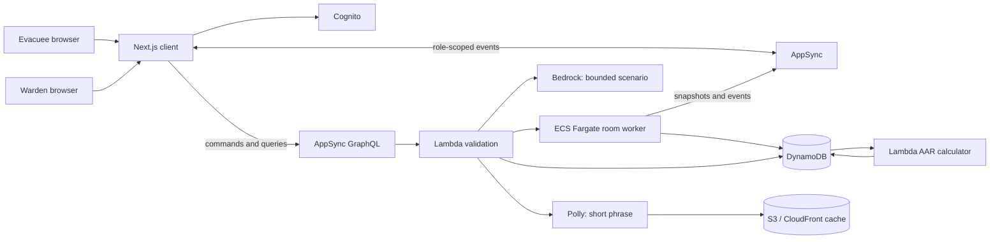

# CampusEvac Architecture Design

**Status:** [IN PROGRESS] Target architecture and migration contract.

**Current runtime:** The repository runs a Next.js client with React Three Fiber, Rapier, a
deterministic local room adapter, and an AppSync adapter boundary. The AWS CDK and Lambda scaffold
exists, but the deployed room worker path is not operational yet.

## Architecture Position

CampusEvac needs authoritative coordination, not a large cloud diagram. The architecture must:

1. Keep the evacuee responsive while server state remains authoritative.
2. Enforce the information boundary in API payloads, not only in React components.
3. Keep the active two-person room state in one authoritative process.
4. Persist meaningful drill events and checkpoints, not rendered frames.
5. Make a run reproducible from a scenario version, seed, and ordered event ledger.
6. Give every provider path a visible fallback and an honest failure state.

## Current Versus Target

| Concern | Current repository | CampusEvac MVP target |
| --- | --- | --- |
| Web client | Next.js App Router, R3F, Rapier, Tailwind | Preserve and retarget the existing engine. |
| Room transport | Deterministic local adapter plus an AppSync adapter boundary | AppSync GraphQL control plane plus role-scoped realtime events. |
| Active state | Browser-local deterministic scenario | One Fargate room worker for mutable drill state and fixed hazard ticks. |
| Durable history | CDK table and Lambda event/AAR scaffold | DynamoDB event ledger, checkpoint, and AAR. |
| Scenario | Authored/legacy prototype behavior | Authored seed with optional validated Bedrock proposal. |
| Audio | Deterministic browser cues with captions | Polly phrase cache with captions and local fallback. |
| Identity | Pseudonymous local room membership | Cognito membership and role claims. |
| Deployment | Local or existing web deployment | AWS proof path first; production hardening is post-hackathon. |

## MVP Service Responsibilities

Use the smallest service set that proves the product. A service is not considered shipped until
its input, output, failure behavior, and demo evidence are documented.

| Service | MVP responsibility | Not responsible for |
| --- | --- | --- |
| Next.js / Amplify or CloudFront | Serve the client and static assets. | Authoritative room state. |
| Cognito | Authenticate participants and carry `EVACUEE` or `WARDEN` claims. | Deciding route outcomes. |
| AppSync GraphQL | Join, role assignment, commands, acknowledgements, AAR queries. | A 30 Hz game loop. |
| AppSync Events or subscriptions | Fan out role-scoped snapshots and meaningful events. | Durable history. |
| ECS Fargate | Own the active room's route block, smoke level, intervention, phase, and checkpoint cadence. | User identity or institutional analytics. |
| Lambda | Validate commands, start a scenario, calculate the AAR, and orchestrate bounded providers. | Holding mutable room state between calls. |
| DynamoDB | Store drill metadata, ordered events, checkpoints, and AAR. | Per-frame movement. |
| Bedrock | Propose bounded scenario parameters before a drill. | Live movement or hidden hazard decisions. |
| Polly plus S3/CloudFront | Generate and cache short phrases with captions. | Continuous conversation. |
| CloudWatch / CloudTrail | Operational logs, latency, failures, and audit access. | Student-facing scoring. |

Fargate is justified only for active room state that needs a stable owner and a fixed timestep.
It is not required for static content, AAR calculation, or scenario generation. If the MVP cannot
deploy a worker safely, use the deterministic local adapter and label the AWS room worker
`[PLANNED]`; do not pretend Lambda is a persistent game loop.

## Reference Flow



The local adapter currently occupies the browser development path while AppSync and the room worker
are completed. It must remain an explicit fallback, not an invisible second production source of
truth.

## Room Contract

The target room owns these fields:

```text
drillId
scenarioVersion
seed
phase: briefing | active | assembly | failed | reported
routeBlockId
smokeIntensityBySector
interventionState
roleMembership
stateVersion
eventSequence
```

The worker accepts intent, not arbitrary state mutation:

```text
joinDrill(drillId, roleRequest)
submitMovement(seq, movementVector)
verifyEvidence(evidenceId, clientSentAt)
sendRouteMessage(target, direction, confidence, expiresAt)
applyIntervention(interventionId, idempotencyKey)
confirmAssembly()
```

Every command is checked for membership, role, phase, target, cooldown, version, and
idempotency. A denied command produces a visible reason and never mutates the room.

## Information Boundary

### Evacuee payload

- Own position, current sector, movement feedback, smoke/air pressure, and assembly status.
- Physical door outcomes and messages explicitly sent by the warden.
- No hidden hazard coordinates, warden confidence, thermal grid, or future route state.

### Warden payload

- Assigned sector, evidence source, confidence, age, route status, and permitted evacuee marker.
- No complete building solution or unassigned sector data.

Build these as separate response types. Do not return a shared object with hidden fields set to
`null`.

## State And Persistence

1. The client samples input locally for responsive movement.
2. The room worker validates movement and advances the bounded scenario at a fixed interval.
3. The worker emits role-scoped snapshots and important command acknowledgements.
4. Clients reconcile toward the authoritative version without visibly teleporting on every event.
5. The worker writes meaningful events immediately and checkpoints at a low, bounded cadence.
6. Lambda calculates the AAR from the ordered ledger and rules version.

Persist:

- Drill metadata and membership.
- Observation, verification, communication, intervention, connection, and outcome events.
- One or more state checkpoints.
- AAR inputs, score version, and replay recommendation.

Do not persist every rendered position, microphone stream, or raw identifying movement history.

## Provider Fallbacks

| Provider path | Fallback |
| --- | --- |
| Bedrock | Fixed seed scenario that passes the same schema and topology validator. |
| Polly | Caption plus deterministic local audio cue or browser speech path. |
| AppSync reconnect | Preserve seat, show stale state, replay from last acknowledged version. |
| Fargate worker loss | Mark the drill recoverable/incomplete; never report silent success. |
| DynamoDB write failure | Retry checkpoints and mark the AAR incomplete if durability is not restored. |

Fallback behavior is part of the demo, not an invisible error handler.

## Security And Privacy

- Never put AWS access keys in the browser or commit credentials.
- Authorize drill membership and role-scoped subscriptions server-side.
- Use pseudonymous participant IDs in events and reports.
- Redact names and movement details from operational logs.
- Encrypt DynamoDB and S3 according to the deployment environment.
- Record report reads and exports for institutional governance.
- Treat the simulation as training, not live emergency guidance.

## Migration Gates

1. Freeze the current R3F/Rapier engine with a deterministic local scenario.
2. Define role-scoped event and command contracts.
3. Implement a local adapter that follows those contracts.
4. Add AppSync behind a feature flag and run two-device join/command/reconnect tests.
5. Deploy the smallest Fargate worker only after the state contract is stable.
6. Add DynamoDB event/AAR persistence and test replay determinism.
7. Move room membership and active state to the AWS path before calling the deployment operational.

## References

- AWS AppSync real-time data: https://docs.aws.amazon.com/appsync/latest/devguide/aws-appsync-real-time-data.html
- Amazon ECS on AWS Fargate: https://docs.aws.amazon.com/AmazonECS/latest/developerguide/AWS_Fargate.html
- Amazon Cognito: https://docs.aws.amazon.com/cognito/latest/developerguide/what-is-amazon-cognito.html
- Amazon Bedrock: https://docs.aws.amazon.com/bedrock/latest/userguide/what-is-bedrock.html
- Amazon Polly: https://docs.aws.amazon.com/polly/latest/dg/what-is.html
- Amazon DynamoDB: https://docs.aws.amazon.com/amazondynamodb/latest/developerguide/Introduction.html
