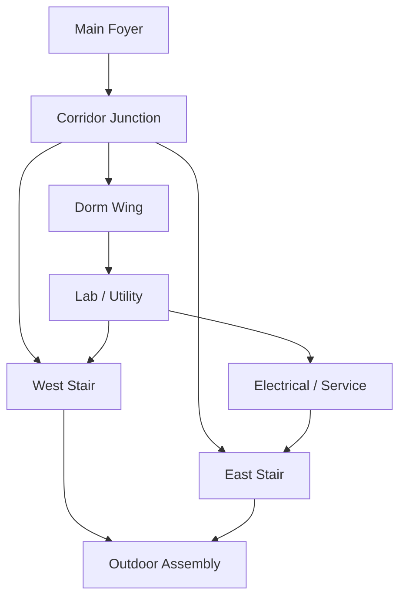

# CampusEvac Environment And Level Design

**Status:** [IN PROGRESS] The compact topology is authored; the current geometry still needs to
be retargeted from the legacy facility layout.

## Level Objective

The first CampusEvac scenario is a compact campus hostel and utility block. A new participant
should understand its landmarks in under a minute. Tension comes from a route decision and
communication delay, not from navigation fatigue or a large map.

## MVP Topology

```text
                         NORTH
        +---------------------------------------------+
        |              OUTDOOR ASSEMBLY               |
        |          beacon / accountability            |
        +----------------------+----------------------+
                               |
                       WEST STAIR | EAST STAIR
                               |       |
        +----------------------+-------+--------------+
        |             MAIN FOYER / NOTICE WALL        |
        |        spawn, briefing, route signage       |
        +------------------+---------------------------+
                           |
                    CORRIDOR JUNCTION
                  primary route decision
                     /              \
            DORM WING              LAB / UTILITY
         lockers, rooms          vents, alternate route
                                      |
                           ELECTRICAL / SERVICE
                         smoke origin and panel
```

This diagram is a gameplay topology, not a construction drawing. Existing wall, opening,
collider, room, and exterior abstractions can be reused.

## Sector Contract

| Sector | Evacuee landmark | Warden evidence | Role in the MVP |
| --- | --- | --- | --- |
| Main Foyer | Notice wall and route sign | Last known position and exit state | Orientation and recovery. |
| Corridor Junction | Split signage and floor stripe | Route block and evidence age | Primary decision point. |
| Dorm Wing | Lockers, room numbers, bed rows | Smoke arrival cue | Orientation and optional detour. |
| Lab / Utility | Ducts, supply rack, ventilation panel | Intervention state | Alternate route and control. |
| Electrical / Service | Warning panel and transformer hum | Smoke source evidence | Scenario origin. |
| West Stair | Blue stair marker and handrail | Route status | Candidate route to assembly. |
| East Stair | Amber marker and emergency light | Blocked/clear evidence | The alternate route. |
| Outdoor Assembly | Green beacon and readable sign | Completion state | Success and report anchor. |

## Spatial Rules

- Every sector has one memorable landmark that is not color alone.
- Route signage appears before a participant enters the decision hazard.
- Doors, panels, evidence, route edges, and telemetry share stable IDs.
- Render geometry and collision geometry derive from the same authored layout data.
- The warden view exposes useful relationships without solving the entire building.
- Smoke reduces distance and detail but never hides the nearest required interaction.
- A safe pause pocket exists before the route commitment.
- The first run uses one blocked edge and one viable alternate; do not block both exits.

## Route Graph



The scenario validator applies one block and must still find a route from `Spawn` to
`Assembly`. The chosen route, available alternatives, and blocked edge feed the AAR.

## Primary Scenario

The MVP uses one deterministic smoke scenario:

1. The run begins in the Main Foyer with both exits initially understandable.
2. Smoke originates in Electrical / Service and reduces visibility near the junction.
3. The East Stair becomes unsafe after a server-authorized route-state change.
4. The warden receives evidence before the evacuee can identify the block.
5. The warden verifies the evidence and recommends West Stair, or applies the one intervention.
6. The evacuee chooses and reaches assembly.

Bedrock may vary the seed, timing, or wording after validation. It may not remove the alternate
route or invent a geometry, hazard, or control absent from the authored catalog.

## Interactable Set

| ID kind | Required state | Result | Failure reason |
| --- | --- | --- | --- |
| Emergency door | Route edge and authorization valid | Door opens for a bounded duration. | Locked, unsafe, or offline. |
| Ventilation panel | Powered and not cooling down | Smoke reduces in one authored sector. | Offline, cooldown, or invalid sector. |
| Evidence target | Target belongs to warden sector | Observation becomes timestamped. | Not assigned or already expired. |
| Route sign | Physical sign is in range | Evacuee receives a local landmark cue. | Obscured or not in scenario. |
| Assembly beacon | Evacuee is in the zone | Hold-to-confirm success. | Drill failed or beacon unavailable. |

## Hazard Representation

Use a compact sector field rather than a high-resolution fluid simulation:

```text
sectorId
intensity: 0..1
sourceId
updatedAt
routeEffects
```

The room authority updates the field at a lower rate than movement and emits a versioned state.
The client interpolates the visual density. The warden sees evidence age; the evacuee sees only
local effect and physical feedback.

## Authoring Contract

```ts
type Sector = {
  id: string;
  bounds: Bounds;
  landmark: string;
  camera: CameraPose;
  exits: string[];
};

type RouteEdge = {
  id: string;
  from: string;
  to: string;
  distance: number;
  width: number;
  requires?: "ventilation" | "warden-release";
};

type Scenario = {
  version: string;
  seed: number;
  smokeOrigin: string;
  blockedRoute: string;
  alternateRoute: string;
  intervention: string;
};
```

The scenario generator selects IDs from this catalog. It never invents coordinates, colliders,
or interactions that the client cannot represent.

## Warden Camera

Each sector has an authored camera pose that shows:

- The route entrance and one exit relationship.
- The sector landmark.
- Relevant evidence and intervention equipment.
- The evacuee marker only when permitted.

It hides other sectors' hazard state, future undiscovered evidence, officer-only report data, and
the complete route solution.

## Mobile And Performance Constraints

- Target a readable evacuee view at 60 FPS on a mid-range phone where practical.
- Share materials and instance repeated beds, lockers, signs, and panels.
- Limit local smoke volumes and disable detail layers in low-power mode.
- Keep the fixed warden view stable to reduce GPU and cognitive load.
- Use the minimap as a lightweight SVG/data layer, not a second 3D scene.
- Do not add props until each sector remains readable at portrait width.
