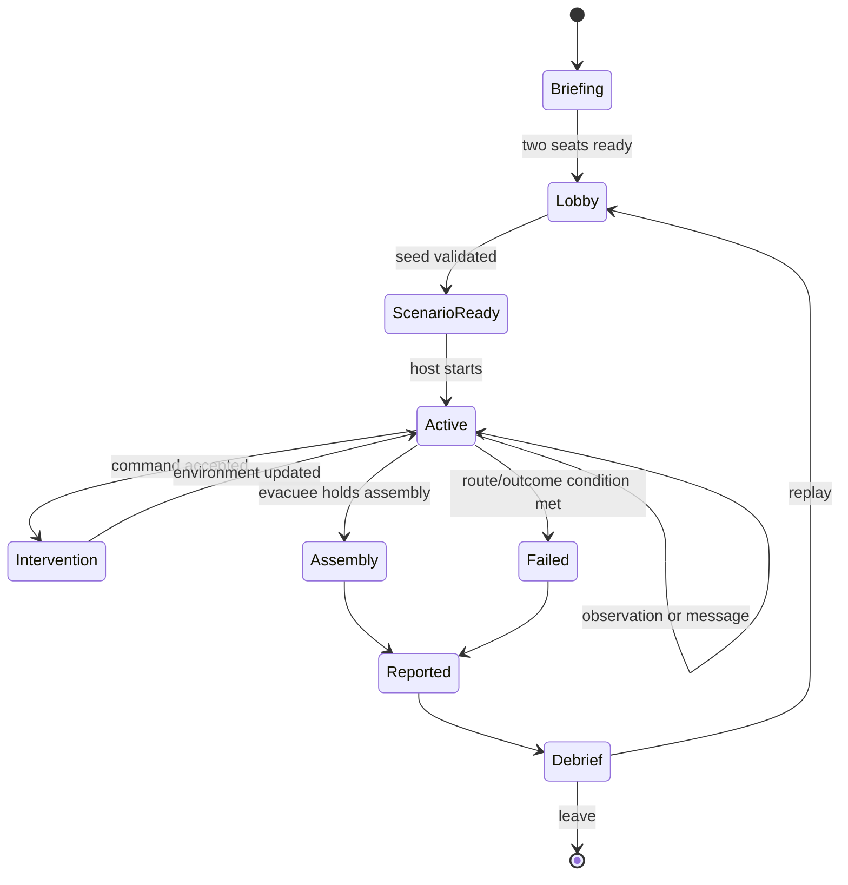

# CampusEvac System And Gameplay Design

**Status:** [IN PROGRESS] The core loop is defined; the legacy facility simulation still needs
to be retargeted to the CampusEvac scenario contract.

## Design Intent

CampusEvac is a short, replayable two-person drill about coordination under incomplete
information. It is not a combat game, a fire simulator, or live emergency guidance.

Every mechanic should teach one of three behaviors:

- Observe the environment instead of following a memorized route.
- Communicate a precise instruction with confidence and age.
- Choose a safe-enough route before the current route closes.

## MVP Loop

```text
OBSERVE -> VERIFY -> COMMUNICATE -> DECIDE -> ADAPT -> MEASURE -> REPLAY
```

The authored demo contains:

- One campus block and one primary smoke scenario.
- One route that becomes unsafe.
- One validated alternate route.
- One warden verification step.
- One structured route message.
- One ventilation or emergency-door intervention.
- One assembly outcome and one replay recommendation.

Fire propagation, multiple simultaneous hazards, NPCs, combat, complex oxygen physiology, and
free-form AI radio are `[POST-HACKATHON]`.

## Role Translation

| Legacy prototype concept | CampusEvac concept | Preserve | Retarget |
| --- | --- | --- | --- |
| Thief | Evacuee | First-person movement, low visibility, interaction, collision. | Assembly and route decisions replace loot and stealth. |
| Spectator | Warden | Fixed sector camera, discovery, command surface. | Evidence verification replaces passive viewing. |
| Alarm panel | Intervention panel | Proximity interaction and state transition. | One authorized ventilation/door action. |
| Extraction pad | Assembly point | Spatial goal and success state. | Training outcome and AAR replace heist completion. |

## Drill State Machine



`Failed` means the training scenario was not completed. It does not label a participant as
unsafe or reproduce a real emergency consequence.

## Scenario Contract

Every scenario is selected or generated before `Active` and must contain:

- A fixed authored campus block and collision layout.
- One smoke origin and bounded intensity curve.
- One blocked or unsafe route edge.
- One viable alternate route to assembly.
- One warden-observable fact the evacuee cannot see directly.
- One intervention that can change the route or smoke state.
- A deterministic seed, scenario version, target duration, and accessibility profile.

The validator must reject an impossible route graph, an unsupported interaction, a block near
spawn, or a scenario that leaves no recoverable route. Bedrock may propose values, but it cannot
invent topology or bypass validation.

## Information States

Every hazard or route observation uses one of these states:

| State | Meaning | Player-facing treatment |
| --- | --- | --- |
| `UNKNOWN` | No useful evidence yet. | Do not recommend a route. |
| `OBSERVED` | A sensor or participant saw a cue. | Show source and observation time. |
| `VERIFIED` | The warden confirmed the cue or route. | Permit a structured recommendation. |
| `STALE` | Evidence is older than the scenario threshold. | Show age and require re-check where needed. |
| `EXPIRED` | The evidence is no longer actionable. | Remove route validity and explain why. |

The evacuee sees only the information explicitly communicated or physically observable. The
warden sees evidence for its assigned sector, not a complete solved map.

## Evacuee Pressure Model

The MVP uses light pressure, not a medical simulation:

- Smoke reduces visibility and increases urgency.
- A simple air/oxygen indicator communicates exposure without implying medical accuracy.
- Sprinting trades stamina for time; walking always remains viable.
- A route that requires sprinting to be possible is invalid.
- Failure uses a clear training threshold and a grace period for acknowledgement.

Exact values belong to the authored scenario and server contract. They must not be hard-coded in
the documentation as validated real-world thresholds.

## Movement And Interaction

- Desktop: keyboard movement, pointer-lock look, interact, sprint, and pause.
- Mobile: virtual movement control, touch look surface, and large action button.
- Rapier remains the local collision foundation.
- Local movement can be predicted; authoritative corrections use a target and preserve velocity.
- Doors, panels, evidence, and assembly use a visible prompt and a semantic outcome.
- A blocked route always explains `unsafe`, `offline`, `locked`, or `expired`.

## Hazard And Intervention Model

The first scenario uses one bounded smoke field sampled on authored sectors. The field can:

- Reduce visibility in the evacuee view.
- Mark a route edge unsafe after the server changes its state.
- Provide warden evidence with source, confidence, and age.
- Respond to one authorized ventilation or door intervention.

The client renders an interpolated effect. The server/room worker owns route validity, phase,
intervention cooldown, and outcome. There is no client-authoritative hazard clearance.

## Warden Commands

| Command | Purpose | Result |
| --- | --- | --- |
| `Verify evidence` | Convert an observation into a confirmed fact. | Evidence state and timestamp update. |
| `Send route message` | Tell the evacuee where to go or wait. | Target, direction, confidence, urgency, expiry. |
| `Mark route unsafe` | Share a confirmed block. | Evacuee receives a caption and route marker. |
| `Apply intervention` | Change one authorized environment state. | Door/ventilation state update or explicit denial. |

Commands are suggestions or bounded controls. They never teleport, steer, or silently override
the evacuee.

## Structured Communication

```text
messageId
drillId
senderId
targetSector
direction
kind: route | wait | hazard | assembly
confidence: observed | verified
urgency: normal | urgent
createdAt
expiresAt
caption
```

The latest valid message appears as a non-blocking marker and caption. Conflicting messages show
source and age instead of silently selecting one. Audio is optional; captions are mandatory.

## Outcome Rules

### Success

The evacuee reaches the authored assembly area and holds for the configured confirmation window.
The server records route choice, exposure bucket, communication timing, intervention result, and
assembly time.

### Failure

Failure occurs when the scenario's bounded exposure or time condition is reached, or when the
drill is ended by the host. The debrief names the decision or communication gap and offers a
focused replay. It does not use punitive language.

## Accessibility And Safety

- Reduced-motion mode removes camera shake, scanline movement, and aggressive breathing effects.
- High-contrast mode adds labels, patterns, and shapes to every color state.
- Captions mirror every critical audio cue.
- Practice mode disables failure while retaining clearly marked training telemetry.
- Onboarding states that the simulation is not instructions for an active emergency.
- The scenario never asks a participant to enter or reproduce a real hazard.

## Required Events

At minimum, record server-ordered events for:

- Role join and reconnect.
- Observation and verification.
- Route block or hazard state change.
- Message sent, delivered, acknowledged, expired, or denied.
- Intervention requested, accepted, denied, and completed.
- Sector transitions and assembly/failure outcome.

See [`compliance-scoring-spec.md`](compliance-scoring-spec.md) for the event envelope and AAR
mapping.
